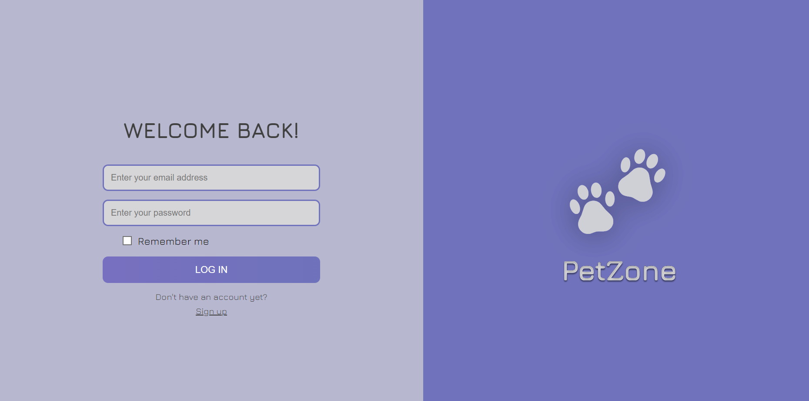

# PetZone

## Description
A web application that connects pet owners with professional petsitters. The platform allows pet owners to find reliable care for their pets while they are away, and enables petsitters to manage their petsitting business.
## Key Features
- User registration
  

- User login
  

- Advanced petsitter search
  

- Profile management for both pet owners and petsitters
  

- Pet registration system
  

- Booking system for petsitting services
  

## Installation
- Clone the repository: https://github.com/alicjanitecka/WDPAI
- Configure Docker environment: docker-compose up
- Set up the database using provided SQL scripts

## Technologies
- HTML5
- CSS
- PHP
- JavaScript
- PostgreSQL

## ERD Diagram

# Author
Alicja Nitecka
